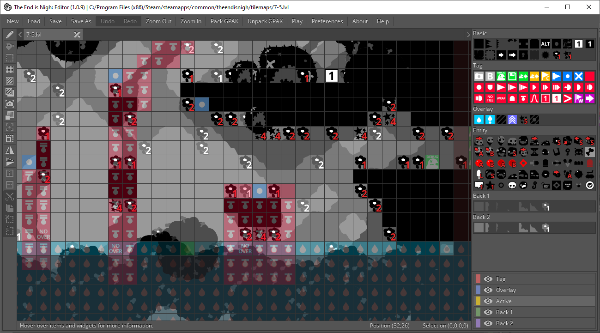

# The End is Nigh: Studio

An unofficial level and world map editor for the game **[The End is Nigh](https://store.steampowered.com/app/583470/The_End_Is_Nigh/)**, by Edmund McMillen and Tyler Glaiel.

The editor provides the necessary tools for modders to unpack the game's resources, modify and create new levels, and modify the world map, all with an
easy-to-use interface.

## Building

For those interested in contributing to the editor's development, building the executable is as simple as running one of the available build scripts, or
using a provided Visual Studio 2022 project file.

### Windows

You can use the Visual Studio 2022 project files, although they should only be used for debugging. For final releases, run build\win32\release. Yes, the
open file dialog is broken when debugging with Visual Studio, but it should work outside of debugging.

## License

The project's code is available under the **[MIT License](https://github.com/Finxx1/tein-studio/blob/master/LICENSE)**.
